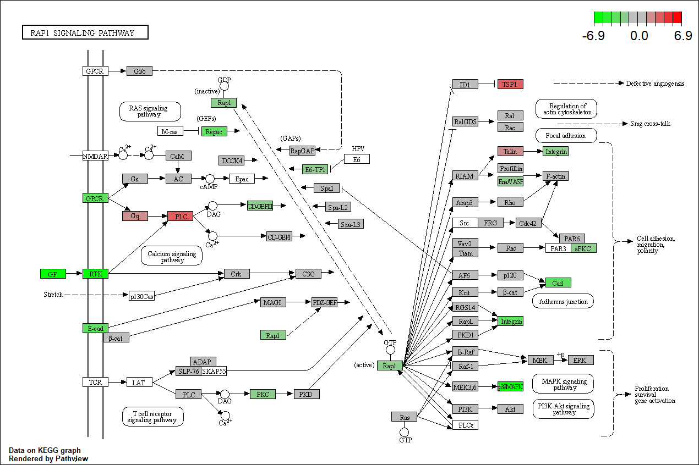

<script>
function buildQuiz(myq, qc){
  // variable to store the HTML output
  const output = [];

  // for each question...
  myq.forEach(
    (currentQuestion, questionNumber) => {

      // variable to store the list of possible answers
      const answers = [];

      // and for each available answer...
      for(letter in currentQuestion.answers){

        // ...add an HTML radio button
        answers.push(
          `<label>
            <input type="radio" name="question${questionNumber}" value="${letter}">
            ${letter} :
            ${currentQuestion.answers[letter]}
          </label><br/>`
        );
      }

      // add this question and its answers to the output
      output.push(
        `<div class="question"> ${currentQuestion.question} </div>
        <div class="answers"> ${answers.join('')} </div><br/>`
      );
    }
  );

  // finally combine our output list into one string of HTML and put it on the page
  qc.innerHTML = output.join('');
}

function showResults(myq, qc, rc){

  // gather answer containers from our quiz
  const answerContainers = qc.querySelectorAll('.answers');

  // keep track of user's answers
  let numCorrect = 0;

  // for each question...
  myq.forEach( (currentQuestion, questionNumber) => {

    // find selected answer
    const answerContainer = answerContainers[questionNumber];
    const selector = `input[name=question${questionNumber}]:checked`;
    const userAnswer = (answerContainer.querySelector(selector) || {}).value;

    // if answer is correct
    if(userAnswer === currentQuestion.correctAnswer){
      // add to the number of correct answers
      numCorrect++;

      // color the answers green
      answerContainers[questionNumber].style.color = 'lightgreen';
    }
    // if answer is wrong or blank
    else{
      // color the answers red
      answerContainers[questionNumber].style.color = 'red';
    }
  });

  // show number of correct answers out of total
  rc.innerHTML = `${numCorrect} out of ${myq.length}`;
}
</script>


# GO AND KEGG Enrichment Analysis

Load libraries

``` r
library(topGO)
library(org.Mm.eg.db)
library(clusterProfiler)
library(pathview)
library(enrichplot)
library(ggplot2)
library(dplyr)
```

Files for examples were created in the DE analysis.

## Gene Ontology (GO) Enrichment

[Gene ontology](http://www.geneontology.org/) provides a controlled vocabulary for describing biological processes (BP ontology), molecular functions (MF ontology) and cellular components (CC ontology)

The GO ontologies themselves are organism-independent; terms are associated with genes for a specific organism through direct experimentation or through sequence homology with another organism and its GO annotation.

Terms are related to other terms through parent-child relationships in a directed acylic graph.

Enrichment analysis provides one way of drawing conclusions about a set of differential expression results.

**1\.** topGO Example Using Kolmogorov-Smirnov Testing
Our first example uses Kolmogorov-Smirnov Testing for enrichment testing of our mouse DE results, with GO annotation obtained from the Bioconductor database org.Mm.eg.db.

The first step in each topGO analysis is to create a topGOdata object.  This contains the genes, the score for each gene (here we use the p-value from the DE test), the GO terms associated with each gene, and the ontology to be used (here we use the biological process ontology)

``` r
infile <- "WT.C_v_WT.NC.txt"
DE <- read.delim(infile)

## Add entrezgene IDs to top table
tmp <- bitr(DE$Gene.stable.ID, fromType = "ENSEMBL", toType = "ENTREZID", OrgDb = org.Mm.eg.db)
```

```
## 'select()' returned 1:many mapping between keys and columns
```

```
## Warning in bitr(DE$Gene.stable.ID, fromType = "ENSEMBL", toType = "ENTREZID", :
## 15.79% of input gene IDs are fail to map...
```

``` r
id.conv <- subset(tmp, !duplicated(tmp$ENSEMBL))
DE <- left_join(DE, id.conv, by = c("Gene.stable.ID" = "ENSEMBL"))

# Make gene list
DE.nodupENTREZ <- subset(DE, !is.na(ENTREZID) & !duplicated(ENTREZID))
geneList <- DE.nodupENTREZ$P.Value
names(geneList) <- DE.nodupENTREZ$ENTREZID
head(geneList)
```

```
##       104718        18795        67241        94212        12521        12772 
## 1.705584e-15 2.616034e-15 3.237429e-15 4.128023e-15 4.423061e-15 1.053529e-14
```

``` r
# Create topGOData object
GOdata <- new("topGOdata",
	ontology = "BP",
	allGenes = geneList,
	geneSelectionFun = function(x)x,
	annot = annFUN.org , mapping = "org.Mm.eg.db")
```

```
## 
## Building most specific GOs .....
```

```
## 	( 11110 GO terms found. )
```

```
## 
## Build GO DAG topology ..........
```

```
## 	( 14385 GO terms and 32270 relations. )
```

```
## 
## Annotating nodes ...............
```

```
## 	( 12523 genes annotated to the GO terms. )
```

**2\.** The topGOdata object is then used as input for enrichment testing:

``` r
# Kolmogorov-Smirnov testing
resultKS <- runTest(GOdata, algorithm = "weight01", statistic = "ks")
```

```
## 
## 			 -- Weight01 Algorithm -- 
## 
## 		 the algorithm is scoring 14385 nontrivial nodes
## 		 parameters: 
## 			 test statistic: ks
## 			 score order: increasing
```

```
## 
## 	 Level 19:	2 nodes to be scored	(0 eliminated genes)
```

```
## 
## 	 Level 18:	27 nodes to be scored	(0 eliminated genes)
```

```
## 
## 	 Level 17:	54 nodes to be scored	(33 eliminated genes)
```

```
## 
## 	 Level 16:	92 nodes to be scored	(102 eliminated genes)
```

```
## 
## 	 Level 15:	136 nodes to be scored	(217 eliminated genes)
```

```
## 
## 	 Level 14:	281 nodes to be scored	(502 eliminated genes)
```

```
## 
## 	 Level 13:	621 nodes to be scored	(840 eliminated genes)
```

```
## 
## 	 Level 12:	1095 nodes to be scored	(1627 eliminated genes)
```

```
## 
## 	 Level 11:	1638 nodes to be scored	(2932 eliminated genes)
```

```
## 
## 	 Level 10:	1941 nodes to be scored	(4979 eliminated genes)
```

```
## 
## 	 Level 9:	2115 nodes to be scored	(6787 eliminated genes)
```

```
## 
## 	 Level 8:	2030 nodes to be scored	(8326 eliminated genes)
```

```
## 
## 	 Level 7:	1810 nodes to be scored	(9479 eliminated genes)
```

```
## 
## 	 Level 6:	1340 nodes to be scored	(10261 eliminated genes)
```

```
## 
## 	 Level 5:	718 nodes to be scored	(10777 eliminated genes)
```

```
## 
## 	 Level 4:	350 nodes to be scored	(11069 eliminated genes)
```

```
## 
## 	 Level 3:	116 nodes to be scored	(11198 eliminated genes)
```

```
## 
## 	 Level 2:	18 nodes to be scored	(11256 eliminated genes)
```

```
## 
## 	 Level 1:	1 nodes to be scored	(11288 eliminated genes)
```

``` r
tab <- GenTable(GOdata, raw.p.value = resultKS, topNodes = length(resultKS@score), numChar = 120)
```

topGO by default preferentially tests more specific terms, utilizing the topology of the GO graph. The algorithms used are described in detail [here](https://academic.oup.com/bioinformatics/article/22/13/1600/193669).


``` r
head(tab, 15)
```

```
##         GO.ID                                                             Term
## 1  GO:0045071                  negative regulation of viral genome replication
## 2  GO:0045944        positive regulation of transcription by RNA polymerase II
## 3  GO:0032731             positive regulation of interleukin-1 beta production
## 4  GO:0045087                                           innate immune response
## 5  GO:0032760          positive regulation of tumor necrosis factor production
## 6  GO:0051607                                        defense response to virus
## 7  GO:0050830                      defense response to Gram-positive bacterium
## 8  GO:0071285                                 cellular response to lithium ion
## 9  GO:0140972        negative regulation of AIM2 inflammasome complex assembly
## 10 GO:0006002                           fructose 6-phosphate metabolic process
## 11 GO:0032728                positive regulation of interferon-beta production
## 12 GO:0097202               activation of cysteine-type endopeptidase activity
## 13 GO:0051091 positive regulation of DNA-binding transcription factor activity
## 14 GO:0036151                        phosphatidylcholine acyl-chain remodeling
## 15 GO:0072672                                         neutrophil extravasation
##    Annotated Significant Expected raw.p.value
## 1         57          57       57     2.0e-09
## 2        890         890      890     2.9e-09
## 3         61          61       61     7.0e-08
## 4        719         719      719     1.4e-07
## 5        107         107      107     4.3e-07
## 6        263         263      263     1.1e-06
## 7         82          82       82     1.4e-06
## 8         10          10       10     4.3e-06
## 9         12          12       12     4.3e-06
## 10        11          11       11     9.3e-06
## 11        47          47       47     1.7e-05
## 12        24          24       24     1.9e-05
## 13       177         177      177     3.5e-05
## 14         9           9        9     4.6e-05
## 15        15          15       15     4.8e-05
```

* Annotated: number of genes (in our gene list) that are annotated with the term
* Significant: n/a for this example, same as Annotated here
* Expected: n/a for this example, same as Annotated here
* raw.p.value: P-value from Kolomogorov-Smirnov test that DE p-values annotated with the term are smaller (i.e. more significant) than those not annotated with the term.

The Kolmogorov-Smirnov test directly compares two probability distributions based on their maximum distance.  

To illustrate the KS test, we plot probability distributions of p-values that are and that are not annotated with the term GO:0010556 "regulation of macromolecule biosynthetic process" (2344 genes) p-value 1.00.  (This won't exactly match what topGO does due to their elimination algorithm):


``` r
rna.pp.terms <- genesInTerm(GOdata)[["GO:0010556"]] # get genes associated with term
p.values.in <- geneList[names(geneList) %in% rna.pp.terms]
p.values.out <- geneList[!(names(geneList) %in% rna.pp.terms)]
plot.ecdf(p.values.in, verticals = T, do.points = F, col = "red", lwd = 2, xlim = c(0,1),
          main = "Empirical Distribution of DE P-Values by Annotation with 'regulation of macromolecule biosynthetic process'",
          cex.main = 0.9, xlab = "p", ylab = "Probability(P-Value <= p)")
ecdf.out <- ecdf(p.values.out)
xx <- unique(sort(c(seq(0, 1, length = 201), knots(ecdf.out))))
lines(xx, ecdf.out(xx), col = "black", lwd = 2)
legend("bottomright", legend = c("Genes Annotated with 'regulation of macromolecule biosynthetic process'", "Genes not annotated with 'regulation of macromolecule biosynthetic process'"), lwd = 2, col = 2:1, cex = 0.9)
```

<!-- -->

versus the probability distributions of p-values that are and that are not annotated with the term GO:0045071 "negative regulation of viral genome replication" (54 genes) p-value 3.3x10-9.


``` r
rna.pp.terms <- genesInTerm(GOdata)[["GO:0045071"]] # get genes associated with term
p.values.in <- geneList[names(geneList) %in% rna.pp.terms]
p.values.out <- geneList[!(names(geneList) %in% rna.pp.terms)]
plot.ecdf(p.values.in, verticals = T, do.points = F, col = "red", lwd = 2, xlim = c(0,1),
          main = "Empirical Distribution of DE P-Values by Annotation with 'negative regulation of viral genome replication'",
          cex.main = 0.9, xlab = "p", ylab = "Probability(P-Value <= p)")
ecdf.out <- ecdf(p.values.out)
xx <- unique(sort(c(seq(0, 1, length = 201), knots(ecdf.out))))
lines(xx, ecdf.out(xx), col = "black", lwd = 2)
legend("bottomright", legend = c("Genes Annotated with 'negative regulation of viral genome replication'", "Genes Not Annotated with 'negative regulation of viral genome replication'"), lwd = 2, col = 2:1, cex = 0.9)
```

<!-- -->


We can use the function showSigOfNodes to plot the GO graph for the 2 most significant terms and their parents, color coded by enrichment p-value (red is most significant):

``` r
par(cex = 0.3)
showSigOfNodes(GOdata, score(resultKS), firstSigNodes = 2, useInfo = "def", .NO.CHAR = 40)
```

```
## Loading required package: Rgraphviz
```

```
## Loading required package: grid
```

```
## 
## Attaching package: 'grid'
```

```
## The following object is masked from 'package:topGO':
## 
##     depth
```

```
## 
## Attaching package: 'Rgraphviz'
```

```
## The following objects are masked from 'package:IRanges':
## 
##     from, to
```

```
## The following objects are masked from 'package:S4Vectors':
## 
##     from, to
```

<!-- -->

```
## $dag
## A graphNEL graph with directed edges
## Number of Nodes = 68 
## Number of Edges = 155 
## 
## $complete.dag
## [1] "A graph with 68 nodes."
```

``` r
par(cex = 1)
```

**3\.** topGO Example Using Fisher's Exact Test

Next, we use Fisher's exact test to test for GO enrichment among significantly DE genes.

Create topGOdata object:

``` r
geneList <- DE.nodupENTREZ$adj.P.Val
names(geneList) <- DE.nodupENTREZ$ENTREZID

# Create topGOData object
GOdata <- new("topGOdata",
	ontology = "BP",
	allGenes = geneList,
	geneSelectionFun = function(x) (x < 0.05),
	annot = annFUN.org , mapping = "org.Mm.eg.db")
```

```
## 
## Building most specific GOs .....
```

```
## 	( 11110 GO terms found. )
```

```
## 
## Build GO DAG topology ..........
```

```
## 	( 14385 GO terms and 32270 relations. )
```

```
## 
## Annotating nodes ...............
```

```
## 	( 12523 genes annotated to the GO terms. )
```

Run Fisher's Exact Test:

``` r
resultFisher <- runTest(GOdata, algorithm = "elim", statistic = "fisher")
```

```
## 
## 			 -- Elim Algorithm -- 
## 
## 		 the algorithm is scoring 13091 nontrivial nodes
## 		 parameters: 
## 			 test statistic: fisher
## 			 cutOff: 0.01
```

```
## 
## 	 Level 19:	2 nodes to be scored	(0 eliminated genes)
```

```
## 
## 	 Level 18:	23 nodes to be scored	(0 eliminated genes)
```

```
## 
## 	 Level 17:	46 nodes to be scored	(12 eliminated genes)
```

```
## 
## 	 Level 16:	82 nodes to be scored	(22 eliminated genes)
```

```
## 
## 	 Level 15:	116 nodes to be scored	(77 eliminated genes)
```

```
## 
## 	 Level 14:	244 nodes to be scored	(102 eliminated genes)
```

```
## 
## 	 Level 13:	536 nodes to be scored	(277 eliminated genes)
```

```
## 
## 	 Level 12:	973 nodes to be scored	(538 eliminated genes)
```

```
## 
## 	 Level 11:	1460 nodes to be scored	(2064 eliminated genes)
```

```
## 
## 	 Level 10:	1760 nodes to be scored	(2215 eliminated genes)
```

```
## 
## 	 Level 9:	1924 nodes to be scored	(3237 eliminated genes)
```

```
## 
## 	 Level 8:	1879 nodes to be scored	(3919 eliminated genes)
```

```
## 
## 	 Level 7:	1659 nodes to be scored	(4558 eliminated genes)
```

```
## 
## 	 Level 6:	1246 nodes to be scored	(5649 eliminated genes)
```

```
## 
## 	 Level 5:	678 nodes to be scored	(6209 eliminated genes)
```

```
## 
## 	 Level 4:	334 nodes to be scored	(7481 eliminated genes)
```

```
## 
## 	 Level 3:	110 nodes to be scored	(8857 eliminated genes)
```

```
## 
## 	 Level 2:	18 nodes to be scored	(8857 eliminated genes)
```

```
## 
## 	 Level 1:	1 nodes to be scored	(10926 eliminated genes)
```

``` r
tab <- GenTable(GOdata, raw.p.value = resultFisher, topNodes = length(resultFisher@score),
				numChar = 120)
head(tab)
```

```
##        GO.ID                                                               Term
## 1 GO:0032731               positive regulation of interleukin-1 beta production
## 2 GO:0045944          positive regulation of transcription by RNA polymerase II
## 3 GO:1901224 positive regulation of non-canonical NF-kappaB signal transduction
## 4 GO:0001525                                                       angiogenesis
## 5 GO:0051607                                          defense response to virus
## 6 GO:0042742                                      defense response to bacterium
##   Annotated Significant Expected raw.p.value
## 1        61          53    35.90     1.8e-06
## 2       890         589   523.85     2.0e-06
## 3        54          47    31.78     6.5e-06
## 4       381         272   224.26     6.6e-06
## 5       263         193   154.80     1.9e-05
## 6       206         154   121.25     2.1e-05
```
* Annotated: number of genes (in our gene list) that are annotated with the term
* Significant: Number of significantly DE genes annotated with that term (i.e. genes where geneList = 1)
* Expected: Under random chance, number of genes that would be expected to be significantly DE and annotated with that term
* raw.p.value: P-value from Fisher's Exact Test, testing for association between significance and pathway membership.

Fisher's Exact Test is applied to the table:

**Significance/Annotation**|**Annotated With GO Term**|**Not Annotated With GO Term**
:-----:|:-----:|:-----:
**Significantly DE**|n1|n3
**Not Significantly DE**|n2|n4

and compares the probability of the observed table, conditional on the row and column sums, to what would be expected under random chance.  

Advantages over KS (or Wilcoxon) Tests:

* Ease of interpretation

* Can be applied when you just have a gene list without associated p-values, etc.

Disadvantages:

* Relies on significant/non-significant dichotomy (an interesting gene could have an adjusted p-value of 0.051 and be counted as non-significant)
* Less powerful
* May be less useful if there are very few (or a large number of) significant genes

## Quiz 1

<div id="quiz1" class="quiz"></div>
<button id="submit1">Submit Quiz</button>
<div id="results1" class="output"></div>
<script>
quizContainer1 = document.getElementById('quiz1');
resultsContainer1 = document.getElementById('results1');
submitButton1 = document.getElementById('submit1');

myQuestions1 = [
  {
    question: "Rerun the KS test analysis using the molecular function (MF) ontology.  What is the top GO term listed?",
    answers: {
      a: "chromatin binding",
      b: "angiogenesis",
      c: "calcium ion binding"
    },
    correctAnswer: "a"
  },
  {
      question: "How many genes from the top table are annotated with the term 'actin filament binding'",
    answers: {
      a: "150",
      b: "5,846",
      c: "162"
    },
    correctAnswer: "c"
  },
  {
      question: "Based on the graph above generated by showSigOfNodes, what is one parent term of 'negative regulation of viral genome replication'?",
    answers: {
      a: "metabolic process",
      b: "regulation of viral genome replication",
      c: "angiogenesis"
    },
    correctAnswer: "b"
  }
];

buildQuiz(myQuestions1, quizContainer1);
submitButton1.addEventListener('click', function() {showResults(myQuestions1, quizContainer1, resultsContainer1);});
</script>

## KEGG Pathway Enrichment Testing With clusterProfiler

KEGG, the Kyoto Encyclopedia of Genes and Genomes (https://www.genome.jp/kegg/), provides assignment of genes for many organisms into pathways.

We will conduct KEGG enrichment testing using the Bioconductor package [clusterProfiler](https://doi.org/10.1016/j.xinn.2021.100141). clusterProfiler implements an algorithm very similar to that used by [GSEA](https://www.gsea-msigdb.org/gsea/index.jsp).

Cluster profiler can do much more than KEGG enrichment, check out the [clusterProfiler book](https://yulab-smu.top/biomedical-knowledge-mining-book/index.html).

We will base our KEGG enrichment analysis on the t statistics from differential expression, which allows for directional testing.


``` r
geneList.KEGG <- DE.nodupENTREZ$t                   
geneList.KEGG <- sort(geneList.KEGG, decreasing = TRUE)
names(geneList.KEGG) <- DE.nodupENTREZ$ENTREZID
head(geneList.KEGG)
```

```
##   104718    18795    67241    94212    12521    12772 
## 46.30958 41.37645 40.66526 36.61842 36.45324 36.41880
```


``` r
set.seed(99)
KEGG.results <- gseKEGG(gene = geneList.KEGG, organism = "mmu", pvalueCutoff = 1)
```

```
## Reading KEGG annotation online: "https://rest.kegg.jp/link/mmu/pathway"...
```

```
## Reading KEGG annotation online: "https://rest.kegg.jp/list/pathway/mmu"...
```

```
## using 'fgsea' for GSEA analysis, please cite Korotkevich et al (2019).
```

```
## preparing geneSet collections...
```

```
## GSEA analysis...
```

```
## leading edge analysis...
```

```
## done...
```

``` r
KEGG.results <- setReadable(KEGG.results, OrgDb = "org.Mm.eg.db", keyType = "ENTREZID")
outdat <- as.data.frame(KEGG.results)
head(outdat)
```

```
##                ID
## mmu05200 mmu05200
## mmu05165 mmu05165
## mmu04970 mmu04970
## mmu04961 mmu04961
## mmu04015 mmu04015
## mmu05160 mmu05160
##                                                                                     Description
## mmu05200                                        Pathways in cancer - Mus musculus (house mouse)
## mmu05165                            Human papillomavirus infection - Mus musculus (house mouse)
## mmu04970                                        Salivary secretion - Mus musculus (house mouse)
## mmu04961 Endocrine and other factor-regulated calcium reabsorption - Mus musculus (house mouse)
## mmu04015                                    Rap1 signaling pathway - Mus musculus (house mouse)
## mmu05160                                               Hepatitis C - Mus musculus (house mouse)
##          setSize enrichmentScore      NES       pvalue     p.adjust
## mmu05200     383       0.3775237 1.706969 1.247349e-07 4.128726e-05
## mmu05165     243       0.4007015 1.736567 1.902410e-06 3.148489e-04
## mmu04970      47       0.6289045 2.105886 4.779633e-06 5.273529e-04
## mmu04961      34       0.6843389 2.164339 6.445738e-06 5.333848e-04
## mmu04015     156       0.4494154 1.849634 8.060359e-06 5.335958e-04
## mmu05160     122       0.4685525 1.882945 1.117934e-05 6.167271e-04
##                qvalue rank                   leading_edge
## mmu05200 2.809818e-05 2374 tags=29%, list=18%, signal=25%
## mmu05165 2.142714e-04 2404 tags=30%, list=18%, signal=26%
## mmu04970 3.588918e-04 1135  tags=34%, list=8%, signal=31%
## mmu04961 3.629968e-04 1164  tags=32%, list=9%, signal=30%
## mmu04015 3.631404e-04 2310 tags=35%, list=17%, signal=29%
## mmu05160 4.197157e-04 2310 tags=41%, list=17%, signal=34%
##                                                                                                                                                                                                                                                                                                                                                                                                                                                                                                                                                                                                                                                             core_enrichment
## mmu05200 Plcb1/Notch1/Pparg/Fn1/Gnaq/Ets1/Cdkn1b/Cebpa/Zbtb16/Met/Fzd7/Jag1/Adcy7/Jup/Rxra/Hes1/Rassf5/Pdgfb/Vegfc/Pten/Raf1/Itgb1/Mgst1/Csf2rb2/Ccnd2/Traf1/Gng2/Rb1/Cxcr4/Mitf/Tcf7l2/Bcl2/Col4a2/Il2rg/Calm1/Arhgef1/Cdh1/Rasgrp2/Apaf1/Il3ra/Bcl2l11/Pld1/Rasgrp1/Tgfbr1/Nfe2l2/Dvl1/Stat2/E2f2/Il6st/Araf/Bad/Cks2/Pdgfrb/Prkcb/Egln3/Casp8/Prkacb/Traf3/Esr1/Brca2/Adcy9/Cdk6/Tgfbr2/Col4a1/Stat5b/Bcr/Map2k1/Nfkb1/Camk2g/Gngt2/Lrp6/Smad3/Stat3/Smo/Fas/Ralb/Jak2/Pik3cd/Kras/Akt3/Pik3r2/Hgf/Itgav/Spi1/Pim2/Nfkbia/Crk/Tfg/Akt1/Gadd45g/Mgst3/Calml4/Elk1/Csf1r/Egln2/Il15/Ednrb/Traf2/Gnb1/Sp1/Ppard/Mlh1/Fgfr1/Itga3/Lpar4/Keap1/Chuk/Mapk3/Gng10/Ptger4/Txnrd1
## mmu05165                                                                                                                                                                                                        Notch1/Fn1/Itga1/H2-Q6/Cdkn1b/Fzd7/Jag1/Hes1/Pten/Raf1/Itgb1/Atp6v1b2/Ccnd2/Atp6v1a/Tbpl1/Rb1/Tcf7l2/Thbs1/Col4a2/Vwf/H2-K1/Tyk2/Isg15/Scrib/Maml2/Dvl1/Stat2/H2-Q7/Lfng/Ppp2r5c/Atp6v0c/Itga5/Bad/Pdgfrb/Casp8/Prkacb/Traf3/H2-Q4/Cdk6/Eif2ak2/Col4a1/Mx1/H2-T10/Map2k1/Nfkb1/Creb3l2/Fas/H2-D1/Pik3cd/Mx2/Kras/Akt3/Pik3r2/Tcirg1/Ppp2r1b/Itgav/Irf3/Atp6v1g1/Oasl2/Llgl2/Prkci/H2-T24/Akt1/Ikbke/Oasl1/Dlg1/Itga3/Tnf/Chuk/Nfx1/Mapk3/Ptger4/Itgb7/Itgb5
## mmu04970                                                                                                                                                                                                                                                                                                                                                                                                                                                                                                                                                                   Plcb1/Gnaq/Adrb1/Adcy7/Atp2b1/Slc12a2/Atp1a1/Bst1/Calm1/Adrb2/Lyz2/Itpr1/Prkcb/Cst3/Prkacb/Adcy9
## mmu04961                                                                                                                                                                                                                                                                                                                                                                                                                                                                                                                                                                                                   Plcb1/Gnaq/Ap2a2/Atp2b1/Atp1a1/Clta/Prkcb/Prkacb/Esr1/Adcy9/Cltb
## mmu04015                                                                                                                                                                                                                                                                                                                                     Plcb1/Sipa1l1/Gnaq/Met/Adcy7/P2ry1/Tiam1/Rassf5/Pdgfb/Vegfc/Raf1/Itgb1/Afdn/Itgal/Fpr1/Insr/Vasp/Prkd2/Thbs1/Calm1/Evl/Rras/Cdh1/Rasgrp2/Sipa1l3/Rap1b/Rapgef5/Itgb2/Pdgfrb/Prkcb/Adcy9/Rapgef1/Map2k1/Rap1a/Ralb/Pik3cd/Kras/Akt3/Pik3r2/Hgf/Prkci/Crk/Arap3/Akt1/Vav3/Calml4/Csf1r/Rgs14/Apbb1ip/Tln2/Fgfr1/Lcp2/Lpar4/Mapk3
## mmu05160                                                                                                                                                                                                                                                                                                                                                                     Cd81/Rxra/Raf1/Rb1/Nr1h3/Tyk2/Apaf1/Rnasel/Stat2/E2f2/Araf/Bad/Eif2ak4/Rsad2/Casp8/Traf3/Cdk6/Eif2ak2/Cxcl10/Mx1/Ifit1/Map2k1/Nfkb1/Eif3e/Oas1a/Ywhaz/Stat3/Socs3/Fas/Pik3cd/Mx2/Kras/Akt3/Pik3r2/Ppp2r1b/Irf3/Rigi/Nfkbia/Ifit1bl1/Akt1/Ikbke/Cldn20/Oas2/Mavs/Traf2/Irf7/Oas3/Tnf/Chuk/Mapk3
```

Gene set enrichment analysis output includes the following columns:

* setSize: Number of genes in pathway

* enrichmentScore: [GSEA enrichment score](https://www.gsea-msigdb.org/gsea/doc/GSEAUserGuideTEXT.htm#_Enrichment_Score_(ES)), a statistic reflecting the degree to which a pathway is overrepresented at the top or bottom of the gene list (the gene list here consists of the t-statistics from the DE test).

* NES: [Normalized enrichment score](https://www.gsea-msigdb.org/gsea/doc/GSEAUserGuideTEXT.htm#_Normalized_Enrichment_Score)

* pvalue: Raw p-value from permutation test of enrichment score

* p.adjust: Benjamini-Hochberg false discovery rate adjusted p-value

* qvalue: Storey false discovery rate adjusted p-value 

* rank: Position in ranked list at which maximum enrichment score occurred

* leading_edge: [Statistics from leading edge analysis](https://www.gsea-msigdb.org/gsea/doc/GSEAUserGuideTEXT.htm#_Detailed_Enrichment_Results)

### Dotplot of enrichment results
Gene.ratio = (count of core enrichment genes)/(count of pathway genes)

Core enrichment genes = subset of genes that contribute most to the enrichment result ("leading edge subset")


``` r
dotplot(KEGG.results)
```

<!-- -->

### Pathview plot of log fold changes on KEGG diagram


``` r
foldChangeList <- DE$logFC
xx <- as.list(org.Mm.egENSEMBL2EG)
names(foldChangeList) <- xx[sapply(strsplit(DE$Gene,split="\\."),"[[", 1L)]
head(foldChangeList)
```

```
##    104718     18795     67241     94212     12521     12772 
## -2.042255  3.062891 -2.306549 -1.796391 -2.476432  1.972002
```

``` r
mmu04015 <- pathview(gene.data  = foldChangeList,
                     pathway.id = "mmu04015",
                     species    = "mmu",
                     limit      = list(gene=max(abs(foldChangeList)), cpd=1))
```

```
## 'select()' returned 1:1 mapping between keys and columns
```

```
## Info: Working in directory C:/Users/bpdurbin/OneDrive - University of California, Davis/Desktop/2024-June-RNA-Seq-Analysis/data_analysis
```

```
## Info: Writing image file mmu04015.pathview.png
```




### Barplot of p-values for top pathways
A barplot of -log10(p-value) for the top pathways/terms can be used for any type of enrichment analysis.


``` r
plotdat <- outdat[1:10,]
plotdat$nice.name <- gsub(" - Mus musculus (house mouse)", "", plotdat$Description, fixed = TRUE)

ggplot(plotdat, aes(x = -log10(p.adjust), y = reorder(nice.name, -log10(p.adjust)), fill = setSize)) + geom_bar(stat = "identity") + labs(x = "-log10(P-Value)", y = NULL, fill = "# Genes") + scale_fill_gradient(low = "red", high = "blue")
```

<!-- -->
## Quiz 2

<div id="quiz2" class="quiz"></div>
<button id="submit2">Submit Quiz</button>
<div id="results2" class="output"></div>
<script>
quizContainer2 = document.getElementById('quiz2');
resultsContainer2 = document.getElementById('results2');
submitButton2 = document.getElementById('submit2');

myQuestions2 = [
  {
    question: "How many pathways have an adjusted p-value less than 0.05?",
    answers: {
      a: "69",
      b: "331",
      c: "101"
    },
    correctAnswer: "a"
  },
  {
      question: "Which pathway has the most genes annotated to it?'",
    answers: {
      a: "Glycine, serine and threonine metabolism - Mus musculus (house mouse)",
      b: "Virion - Herpesvirus - Mus musculus (house mouse)",
      c: "Pathways in cancer - Mus musculus (house mouse)"
    },
    correctAnswer: "c"
  },
  {
      question: "Make a pathview diagram for mmu05171, and locate the file mmu05171.pathview.png on your computer.  What sign does the log fold change for MAPK have?",
    answers: {
      a: "Positive",
      b: "Negative"
    },
    correctAnswer: "b"
  }
];

buildQuiz(myQuestions2, quizContainer2);
submitButton2.addEventListener('click', function() {showResults(myQuestions2, quizContainer2, resultsContainer2);});
</script>


``` r
sessionInfo()
```

```
## R version 4.4.0 (2024-04-24 ucrt)
## Platform: x86_64-w64-mingw32/x64
## Running under: Windows 10 x64 (build 19045)
## 
## Matrix products: default
## 
## 
## locale:
## [1] LC_COLLATE=English_United States.utf8 
## [2] LC_CTYPE=English_United States.utf8   
## [3] LC_MONETARY=English_United States.utf8
## [4] LC_NUMERIC=C                          
## [5] LC_TIME=English_United States.utf8    
## 
## time zone: America/Los_Angeles
## tzcode source: internal
## 
## attached base packages:
## [1] grid      stats4    stats     graphics  grDevices utils     datasets 
## [8] methods   base     
## 
## other attached packages:
##  [1] Rgraphviz_2.48.0       dplyr_1.1.4            ggplot2_3.5.1         
##  [4] enrichplot_1.24.0      pathview_1.44.0        clusterProfiler_4.12.0
##  [7] org.Mm.eg.db_3.19.1    topGO_2.56.0           SparseM_1.83          
## [10] GO.db_3.19.1           AnnotationDbi_1.66.0   IRanges_2.38.0        
## [13] S4Vectors_0.42.0       Biobase_2.64.0         graph_1.82.0          
## [16] BiocGenerics_0.50.0   
## 
## loaded via a namespace (and not attached):
##   [1] RColorBrewer_1.1-3      rstudioapi_0.16.0       jsonlite_1.8.8         
##   [4] magrittr_2.0.3          farver_2.1.2            rmarkdown_2.27         
##   [7] fs_1.6.4                zlibbioc_1.50.0         vctrs_0.6.5            
##  [10] memoise_2.0.1           RCurl_1.98-1.14         ggtree_3.12.0          
##  [13] htmltools_0.5.8.1       gridGraphics_0.5-1      sass_0.4.9             
##  [16] bslib_0.7.0             plyr_1.8.9              cachem_1.1.0           
##  [19] igraph_2.0.3            lifecycle_1.0.4         pkgconfig_2.0.3        
##  [22] Matrix_1.7-0            R6_2.5.1                fastmap_1.2.0          
##  [25] gson_0.1.0              GenomeInfoDbData_1.2.12 digest_0.6.35          
##  [28] aplot_0.2.3             colorspace_2.1-0        patchwork_1.2.0        
##  [31] RSQLite_2.3.7           org.Hs.eg.db_3.19.1     labeling_0.4.3         
##  [34] fansi_1.0.6             httr_1.4.7              polyclip_1.10-6        
##  [37] compiler_4.4.0          bit64_4.0.5             withr_3.0.0            
##  [40] BiocParallel_1.38.0     viridis_0.6.5           DBI_1.2.3              
##  [43] highr_0.11              ggforce_0.4.2           MASS_7.3-60.2          
##  [46] HDO.db_0.99.1           tools_4.4.0             ape_5.8                
##  [49] scatterpie_0.2.3        glue_1.7.0              nlme_3.1-164           
##  [52] GOSemSim_2.30.0         shadowtext_0.1.3        reshape2_1.4.4         
##  [55] snow_0.4-4              fgsea_1.30.0            generics_0.1.3         
##  [58] gtable_0.3.5            tidyr_1.3.1             data.table_1.15.4      
##  [61] tidygraph_1.3.1         utf8_1.2.4              XVector_0.44.0         
##  [64] ggrepel_0.9.5           pillar_1.9.0            stringr_1.5.1          
##  [67] yulab.utils_0.1.4       splines_4.4.0           tweenr_2.0.3           
##  [70] treeio_1.28.0           lattice_0.22-6          bit_4.0.5              
##  [73] tidyselect_1.2.1        Biostrings_2.72.1       knitr_1.47             
##  [76] gridExtra_2.3           xfun_0.45               graphlayouts_1.1.1     
##  [79] matrixStats_1.3.0       KEGGgraph_1.64.0        stringi_1.8.4          
##  [82] UCSC.utils_1.0.0        lazyeval_0.2.2          ggfun_0.1.5            
##  [85] yaml_2.3.8              evaluate_0.24.0         codetools_0.2-20       
##  [88] ggraph_2.2.1            tibble_3.2.1            qvalue_2.36.0          
##  [91] ggplotify_0.1.2         cli_3.6.3               munsell_0.5.1          
##  [94] jquerylib_0.1.4         Rcpp_1.0.12             GenomeInfoDb_1.40.1    
##  [97] png_0.1-8               XML_3.99-0.16.1         parallel_4.4.0         
## [100] blob_1.2.4              DOSE_3.30.1             bitops_1.0-7           
## [103] viridisLite_0.4.2       tidytree_0.4.6          scales_1.3.0           
## [106] purrr_1.0.2             crayon_1.5.3            rlang_1.1.4            
## [109] cowplot_1.1.3           fastmatch_1.1-4         KEGGREST_1.44.1
```
