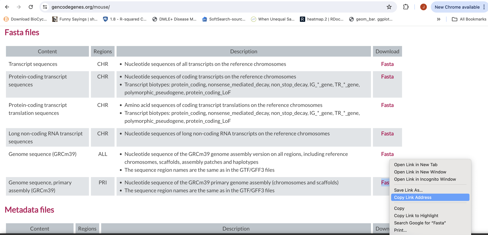
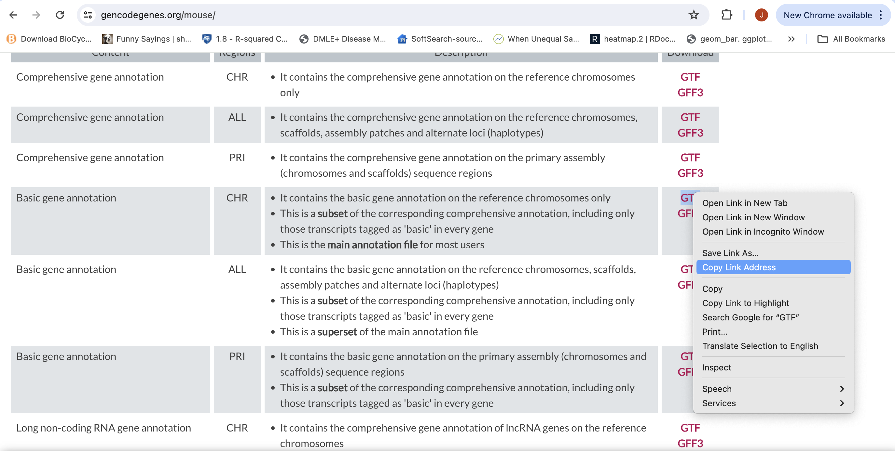

# Indexing a Reference sequence and annotation

1. First lets make sure we are where we are supposed to be and that the References directory is available.

    ```bash
    cd /quobyte/ikorfgrp/bis180l/$USER/rnaseq_example
    mkdir -p References
    ```

1. To align our data we will need the genome (fasta) and annotation (gtf) for mouse. There are many places to find them, but we are going to get them from the [GENCODE](https://www.gencodegenes.org/mouse/).

    We need to first get the url for the genome and annotation gtf. For RNAseq we want to use the primary genome chromosomes and basic gene annotation. At the time of this workshop the current version of GENCODE is *M37* . You will want to update the scripts to use the current version.

    We will need:

    *   Genome sequence, primary assembly (GRCm39)
    *   Basic gene annotation (CHR)

    

    

    Save them into your "References" directory.


1. We are going to use an aligner called ['STAR'](https://www.ncbi.nlm.nih.gov/pmc/articles/PMC3530905/) to align the data. Lets take a look at the help docs for star:

    ```bash
    module load star/2.7.11a
    STAR -h
    ```

    The basic options to generate genome indices using STAR are as follows:

    --runThreadN: number of threads  
    --runMode: genomeGenerate mode  
    --genomeDir: /path/to/store/genome_indices  
    --genomeFastaFiles: /path/to/FASTA_file  
    --sjdbGTFfile: /path/to/GTF_file  
    --sjdbOverhang: readlength -1  

    *NOTE:* In case of reads of varying length, the ideal value for --sjdbOverhang is max(ReadLength)-1. In most cases, the default value of 100 will work similarly to the ideal value.

1. First we need to index the genome for STAR. Lets pull down a slurm script to index the Ensembl version of the mouse genome.

    ```bash
    wget https://raw.githubusercontent.com/ucdavis-bioinformatics-training/2025-Spring-BIS180L/master/rnaseq/software_scripts/scripts/star_index.slurm
    less star_index.slurm
    ```

<div class="script">#!/bin/bash
#SBATCH --job-name=star_index # Job name
#SBATCH --nodes=1
#SBATCH --ntasks-per-node=1
#SBATCH --cpus-per-task=8
#SBATCH --account=publicgrp
#SBATCH --partition=high
#SBATCH --time=120
#SBATCH --mem=40000 # Memory pool for all cores (see also --mem-per-cpu)
#SBATCH --output=slurmout/star-index_%A.out # File to which STDOUT will be written
#SBATCH --error=slurmout/star-index_%A.err # File to which STDERR will be written

start=`date +%s`
echo $HOSTNAME

outpath="References"
cd ${outpath}

refdir=""
FASTA="$refdir/GRCm39.primary_assembly.genome.fa"
GTF="$refdir/gencode.vM37.basic.annotation.gtf"

mkdir star.overlap100.gencode.M35
cd star.overlap100.gencode.M35

module load star/2.7.11a

call="STAR
    --runThreadN ${SLURM_NTASKS} \
    --runMode genomeGenerate \
    --genomeDir . \
    --genomeFastaFiles ${FASTA} \
    --sjdbGTFfile ${GTF} \
    --sjdbOverhang 100"

echo $call
eval $call

end=`date +%s`
runtime=$((end-start))
echo $runtime
</div>

When you are done, type "q" to exit.

* This script creates the star index directory (star.overlap100.gencode.M35).
* Changes directory into the new star index directory. We run the star indexing command from inside the directory, for some reason star fails if you try to run it outside this directory.
* Finally, runs star in mode genomeGenerate.


1. Unzip the genome and annotation files and add your Reference directory to the script. Then run star indexing when ready.

```bash
cd /quobyte/ikorfgrp/bis180l/$USER/rnaseq_example 
sbatch star_index.slurm
```

This step will take a couple of hours. You can look at the [STAR documentation](https://github.com/alexdobin/STAR/blob/master/doc/STARmanual.pdf) while you wait. All of the output files will be written to the star index directory **star.overlap100.gencode.M35**.

**IF, for the sake of time, or for some reason it didn't finish, is corrupted, or you missed the session, you can link over a completed copy.** If the indexing job is still running, it should be canceled first.

```bash
cd /quobyte/ikorfgrp/bis180l/$USER/rnaseq_example/References
ln -s /quobyte/ikorfgrp/bis180l/najoshi/mRNAseq/References/star.overlap100.gencode.M35 .
```
