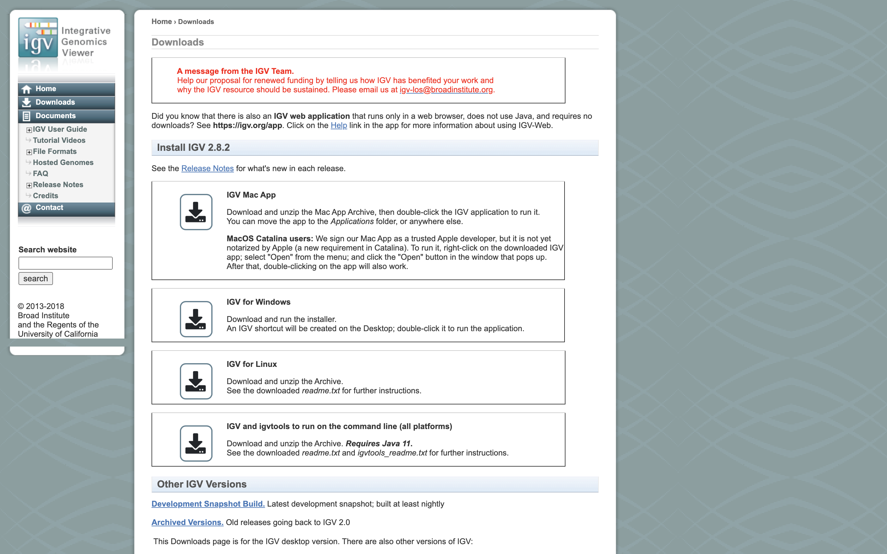

# Alignment to Read Counts & Visualization in IGV
1. Initial Setup
1. Mapping vs Assembly
2. Aligners/Mappers
3. Mapping against the genome vs transcriptome
4. Counting reads as a proxy for gene expression
5. Alignments
6. Running STAR on the experiment
7. Quality Assurance - Mapping statistics as QA/QC.

---
## Initial Setup

*This document assumes [preproc htstream](./preproc_htstream.md) has been completed.*

---
## Mapping vs Assembly

**Assembly** seeks to put together the puzzle without knowing what the picture is.

- The focus is on the pieces, how they fit together.

**Mapping** (or alignment to a reference) tries to put the puzzle pieces directly onto an image of the picture._
- The focus is on the puzzle, regions of the puzzle that contain certain characteristics (ex. what background) that will help you place the piece onto the puzzle.  
- In mapping the question is more, given a small chunk of sequence, where in the genome did this sequence most likely come from.
- The goal then is to find the match(es) with either the “best” edit distance (smallest difference), or all matches with edit distance less than max edit distance. Main issues are:
* Large search space
* Regions of similarity (aka repeats)
* Gaps (INDELS)
* Complexity (RNA, splicing, transcripts)

### Alignment concepts

* Multimappers:
  * Reads that align equally well to more than one reference location.
  * Generally, multimappers are discounted in variant detection, and are often discounted in counting applications (like RNA-Seq ... would “cancel” out anyway).
  * Note: multimapper “rescue” in some algorithms (RSEM, eXpress).
* Duplicates:
  * Reads or read pairs arising from the same original library fragment, either during library preparation (PCR duplicates) or during sequencing (optical duplicates).
  * Generally, duplicates can only be detected reliably with paired-end sequencing. If PE, they’re discounted in variant detection, and discounted in counting applications (like RNA-Seq).
* Clipping vs Splicing  
  * soft-clipped: bases in 5' and 3' of the read are NOT part of the alignment.
  * hard-clipped: bases in 5' and 3' of the read are NOT part of the alignment AND those bases have been
  removed from the read sequence in the BAM file. The 'real' sequence length would be length(SEQ)+ count-of-hard-clipped-bases
  * [From biostars](https://www.biostars.org/p/119537/)

  
* Inner length, insert size, fragment length  
  
*From [This Biostars answer](https://www.biostars.org/p/106291/)*


#### Considerations when mapping
* Placing reads in regions that do not exist in the reference genome (reads extend off the end of linearized fragments) [ mitochondrial, plasmids, structural variants, etc.].
* Sequencing errors and genetic variation: alignment between read and true source in genome may have more differences than alignment with some other copy of repeat.
* What if the closest fully sequenced genome is too divergent?
* Placing reads in repetitive regions: Some algorithms only return 1 mapping; If multiple: map quality = 0
* Algorithms that use paired-end information => might prefer correct distance over correct alignment.

In RNAseq data, you must also consider effect of splice junctions, reads may span an intron.


<iframe width="80%" src="https://www.youtube.com/embed/_asGjfCTLNE" frameborder="0" allow="accelerometer; autoplay; encrypted-media; gyroscope; picture-in-picture" allowfullscreen></iframe>

---
## Aligners/Mappers
Many [alignment algorithms](https://en.wikipedia.org/wiki/List_of_sequence_alignment_software
) to choose from. Examples include:
* Spliced Aligners
  * STAR
  * HiSAT2 (formerly Tophat [Bowtie2])
  * GMAP/GSNAP
  * SOAPsplice
  * MapSplice
* Aligners that can ’clip’
  * bwa-mem
  * Bowtie2 in local mode

#### Pseudo-aligners (salmon and kalisto)
* Quasi-mapping
* Probabilistic
* Map to transcripts, not genome
* Does transcript quantifications (or gene)
* Blazing FAST and can run on most laptops
* Experience suggests differences between “traditional” mappers are in the low abundance genes.

---
## Mapping against the genome vs transcriptome

May seem intuitive to map RNAseq data to transcriptome, but it is not that simple.
  * Transcriptomes are rarely complete.
  * Which transcript of a gene should you map to? canonical transcript (which is that)?
  * Shouldn’t map to all splice variants as these would show up as ‘multi-mappers’.

More so, a aligner will try to map every read, somewhere, provided the alignment meets its minimum requirements.
  * Need to provide a mapper with all possible places the read could have arisen from, which is best represented by the genome. Otherwise, you get mis-mapping because its close enough.

### Genome and Genome Annotation

Genome sequence fasta files and annotation (gff, gtf) files go together! These should be identified at the beginning of analysis.

* Genome fasta files should include all primary chromosomes, unplaced sequences and un-localized sequences, as well as any organelles. Should not contain any contigs that represent patches, or alternative haplotypes.
* If you expect contamination, or the presence of additional sequence/genome, add the sequence(s) to the genome fasta file.
* Annotation file should be GTF (preferred), and should be the most comprehensive you can find.
  * Chromosome names in the GTF must match those in the fasta file (they don’t always do).

---
## Counting reads as a proxy for gene expression

The more you can count (and HTS sequencing systems can count a lot) the better the measure of copy number for even rare transcripts in a population.
* Most RNA-seq techniques deal with count data. Reads are mapped to a reference genome, transcripts are detected, and the number of reads that map to a transcript (or gene) are counted.
* Read counts for a transcript are roughly proportional to the gene’s length and transcript abundance (in whole transcript methods).

Technical artifacts should be considered during counting
* Mapping quality
* Map-ability (uniqueness), the read is not ambiguous

Options are (STAR, HTSEQ, featureCounts)

### The HTSEQ way

* Given a sam/bam file with aligned sequence reads and a list of genomic feature (genes locations), we wish to count the number of reads (fragments) than overlap each feature.
  * Features are defined by intervals, they have a start and stop position on a chromosome.
  * For this workshop and analysis, features are genes which are the union of all its exons. You could consider each exon as a feature, for alternative splicing.
* Htseq-count has three overlapping modes
  * union
  * intersection-strict
  * intersection-nonempty

  
*from the [HTSeq Paper](https://www.ncbi.nlm.nih.gov/pmc/articles/PMC4287950/)*

#### Star Implementation
Counts coincide with Htseq-counts under default parameters (union and tests all orientations). Need to specify GTF file at genome generation step or during mapping.
* Output, 4 columns
  * GeneID
  * Counts for unstranded
  * Counts for first read strand
  * Counts for second read strand

<div class="output">

N_unmapped	213761	213761	213761
N_multimapping	132491	132491	132491
N_noFeature	309643	2619257	322976
N_ambiguous	116750	892	47031
ENSMUSG00000102693	0	0	0
ENSMUSG00000064842	0	0	0
ENSMUSG00000051951	0	0	0
ENSMUSG00000102851	0	0	0
ENSMUSG00000103377	0	0	0
ENSMUSG00000104017	0	0	0
</div>

Choose the appropriate column given the library preparation characteristics and generate a matrix expression table, columns are samples, rows are genes.

What does stranded and unstranded mean? Which is better and why? [Stranded vs Unstraded](https://www.ecseq.com/support/ngs/how-do-strand-specific-sequencing-protocols-work)

---
## Alignments

1. We are now ready to try an alignment:

    ```bash
    cd /quobyte/ikorfgrp/bis180l/$USER/rnaseq_example/HTS_testing
    ```

    and let's run STAR (via srun) on the pair of streamed test files we created earlier:

    ```bash
    srun --time=15:00:00 -n 8 --mem=32g --account=publicgrp --partition=low --pty /bin/bash
    ```

    Once you've been given an interactive session we can run STAR.

1. Then run the star commands

    ```bash
    module load star/2.7.11a
    STAR \
    --runThreadN 12 \
       --genomeDir /quobyte/ikorfgrp/bis180l/$USER/rnaseq_example/References/star.overlap100.gencode.M35 \
       --outSAMtype BAM SortedByCoordinate \
       --quantMode GeneCounts \
       --outFileNamePrefix mouse_110_WT_C.htstream_ \
       --readFilesCommand zcat \
       --readFilesIn mouse_110_WT_C.htstream_R1.fastq.gz mouse_110_WT_C.htstream_R2.fastq.gz
    ```

    In the command, we are telling star to count reads on a gene level ('--quantMode GeneCounts'), the prefix for all the output files will be mouse_110_WT_C.htstream_, the command to unzip the files (zcat), and finally, the input file pair.

    Once finished please 'exit' the srun session.

###  Now let's take a look at an alignment in IGV.

1.  We first need to index the bam file, will use 'samtools' for this step, which is a program to manipulate SAM/BAM files. Take a look at the options for samtools and 'samtools index'.

    ```bash
    module load samtools
    samtools
    samtools index
    ```

    We need to index the BAM file:

    ```bash
    cd /quobyte/ikorfgrp/bis180l/$USER/rnaseq_example/HTS_testing
    samtools index mouse_110_WT_C.htstream_Aligned.sortedByCoord.out.bam
    ```

1. Now we are ready to use IGV. Open a browser inside your Hive Desktop.

    Go to the [IGV page at the Broad Institute](http://software.broadinstitute.org/software/igv/).

    

    And then navigate to the download page, [IGV download](http://software.broadinstitute.org/software/igv/download)

    

    Here you can download IGV for your respective platform (Window, Mac OSX, Linux), but we are going to use the web application they supply, [IGV web app](https://igv.org/app).

    

1. The first thing we want to do is load the Mouse genome. Click on "Genomes" in the menu and choose "Mouse (GRCm39/mm39)".

    

1. Now let's load the alignment bam and index files. Click on "Tracks" and choose "Local File ...".

    

    Navigate to where you transferred the bam and index file and select them **both**.

    

    Now your alignment is loaded. Any loaded bam file aligned to a genome is called a "track".

    

1. Lets take a look at the alignment associated with the gene __Fn1__, and if for some reason it doesn't find Fn1 (web IGV can be fickle) go to position __chr1:71,610,633-71,628,073__. If you don't see any reads, this likely means your in the wrong genome, double check that it says **mm39** in the top left.

    

    

    You can zoom in by clicking on the plus sign (top right) or zoom out by clicking the negative sign (click it twice). You also may have to move around by clicking and dragging in the BAM track window.

    You can also zoom in by clicking and dragging across the number line at the top. That section will highlight, and when you release the button, it will zoom into that section.

    

    

    Reset the window by searching for Fn1 again, **and** then zoom in 2 steps.

    

1. See that the reads should be aligning within the exons in the gene. This makes sense, since RNA-Seq reads are from exons. Play with the settings on the right hand side a bit and selecting reads.

    

    

    

    

    


---
## Running STAR on the experiment
### <font color='red'> Start Group Exercise: </font>
- work through Running STAR on all samples
- work through QA/QC of the experiment
- complete the questions at the end


We can now run STAR across all samples on the real data using a SLURM script, [star.slurm](../software_scripts/scripts/star.slurm), that we should take a look at now.

```bash
cd /quobyte/ikorfgrp/bis180l/$USER/rnaseq_example  # We'll run this from the main directory
wget https://raw.githubusercontent.com/ucdavis-bioinformatics-training/2025-Spring-BIS180L/master/rnaseq/software_scripts/scripts/star.slurm
less star.slurm
```

<div class="script">#!/bin/bash

#SBATCH --job-name=star # Job name
#SBATCH --nodes=1
#SBATCH --ntasks-per-node=1
#SBATCH --cpus-per-task=8
#SBATCH --account=publicgrp
#SBATCH --partition=low
#SBATCH --time=60
#SBATCH --mem=32000 # Memory pool for all cores (see also --mem-per-cpu)
#SBATCH --array=1-22
#SBATCH --output=slurmout/star_%A_%a.out # File to which STDOUT will be written
#SBATCH --error=slurmout/star_%A_%a.err # File to which STDERR will be written

start=`date +%s`
echo $HOSTNAME
echo "My SLURM_ARRAY_TASK_ID: " $SLURM_ARRAY_TASK_ID

sample=`sed "${SLURM_ARRAY_TASK_ID}q;d" samples.txt`
REF="/quobyte/ikorfgrp/bis180l/mRNAseq/References/star.overlap100.gencode.M35"

outpath='02-STAR_alignment'
[[ -d ${outpath} ]] || mkdir ${outpath}
[[ -d ${outpath}/${sample} ]] || mkdir ${outpath}/${sample}

echo "SAMPLE: ${sample}"

module load star/2.7.11a

call="STAR
     --runThreadN 8 \
     --genomeDir $REF \
     --outSAMtype BAM SortedByCoordinate \
     --readFilesCommand zcat \
     --readFilesIn 01-HTS_Preproc/${sample}/${sample}_R1.fastq.gz 01-HTS_Preproc/${sample}/${sample}_R2.fastq.gz \
     --quantMode GeneCounts \
     --outFileNamePrefix ${outpath}/${sample}/${sample}_ \
     > ${outpath}/${sample}/${sample}-STAR.stdout 2> ${outpath}/${sample}/${sample}-STAR.stderr"

echo $call
eval $call

end=`date +%s`
runtime=$((end-start))
echo $runtime
</div>


When you are done, type "q" to exit.

After looking at the script, lets run it.

```bash
sbatch star.slurm  # moment of truth!
```

We can watch the progress of our task array using the 'squeue' command. Takes about 2 minutes to process each sample.

```sbatch
squeue -u $USER 
```


---
## Quality Assurance - Mapping statistics as QA/QC.

Once your jobs have finished successfully, check the error and out logs like we did in the previous exercise.

  Use a script of ours, [star_stats.R](../software_scripts/scripts/star_stats.R) to collect the alignment stats.

```bash
cd /quobyte/ikorfgrp/bis180l/$USER/rnaseq_example # We'll run this from the main directory
wget https://raw.githubusercontent.com/ucdavis-bioinformatics-training/2025-Spring-BIS180L/master/rnaseq/software_scripts/scripts/star_stats.R
module load R
Rscript star_stats.R
```

    <pre class="prettyprint"><code class="language-r" style="background-color:333333">
files = Sys.glob("02-STAR_alignment/*/*_ReadsPerGene.out.tab")
stats = t(as.data.frame(lapply(files, function(x){read.delim(x,header=F,nrows=4)[,4]})))
samples=read.delim("samples.txt",header=F)
rownames(stats) = samples[,1]
cn = lapply(files, function(x){read.delim(x,header=F,nrows=4)})[[1]][,1]
colnames(stats) = cn
stats = cbind(stats,total_in_feature=rowSums(stats))
stats = cbind(sample=rownames(stats), stats)
write.table(stats, file="summary_star_alignments.txt", col.names=T, row.names=F, quote=F, sep="\t")
    </code></pre>


**Questions:**
1. Look at the script `star.slurm`. What does the `array=1-22` mean, why is it used, and what is the usage of it in the script itself?
2. Look through the files in an output directory and check out what is present and discuss what each of them mean. (for example: `cd /quobyte/ikorfgrp/bis180l/$USER/rnaseq_example/02-STAR_alignment/mouse_110_WT_C` )
3. Come up with a brief command you might use to check that all of the sample alignments using STAR have a reasonable output and/or did not produce any errors.
4. Open `summary_star_alignments.txt` in excel (or excel like application), and review. Are all samples behaving similarly? Discuss ...
5. If time, find some other regions/genes with high expression using IGV with your group. (Looking at genes the paper references is a great place to start)

### <font color='red'> Stop Group Exercise </font>
